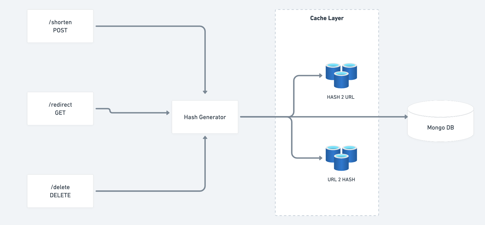

# Build your own URL Shortner

URL Shortner is a service that shortens long URL into short URLS that we can easily share and remember. This mini-project is a complete backend implementation of URL Shortner that is built using

- FastAPI (Python)
- Redis Cache
- MongoDB

## Features
- Shorten a long URL to a short URL
- Paste the short URL in browser to visit the actual site (long URL)
- Delete the short URL
- Create a custom short URL that anyone can easily remember


The project was an attempt to solve the [Coding Challenge ](https://codingchallenges.fyi/challenges/challenge-url-shortener/) from [John Crickett](https://www.linkedin.com/in/johncrickett/)

## A simple representation of the solution




## Installation

1. Install Docker
2. Install Redis Cache
 ```sh
docker run -d --name redis-container -p 6379:6379 redis:latest 
```
3. Install Mongo db
```sh
docker run -d --name mongodb-container -p 27017:27017 \       
  -e MONGO_INITDB_ROOT_USERNAME=admin \
  -e MONGO_INITDB_ROOT_PASSWORD=admin \
  mongo:latest
```
4. create a virtual environment. Follow this simple [guide](https://medium.com/datacat/a-simple-guide-to-creating-a-virtual-environment-in-python-for-windows-and-mac-1079f40be518) to create a virtual environment

5. install the prerequisites
```sh
pip install -r requirements.txt
```

6. Run the app using following command
```sh
uvicorn api:app --reload
```
## Run the app

1. Shorten a URL

```sh
curl -X POST -H "Content-Type: application/json" -d '{"url": "https://www.example.com"}' http://localhost:8000/shorten
```
2. Use the short URL
- Open a browser
- paste the short URL
- Notice that the app redirects the short URL to long URLs web page

3. Delete a short URL
```sh
curl -X DELETE http://localhost:8000/yCypqR+ -i
```
`Note: make sure to use the app generated hash above`
- Once the URL is removed, try the short URL in web browser, it won't redirect to the original URL.

## TODO
1. Implement custom hashing
2. Implement a front end that consumes the APIs
3. DockerFile and CI/CD Implementation 


## Connect with me

| Plugin | README |
| ------ | ------ |
| LinkedIn | [Profile](https://www.linkedin.com/in/arjunvv/) |
| GitHub | [Profile](https://github.com/vishyarjun) |

